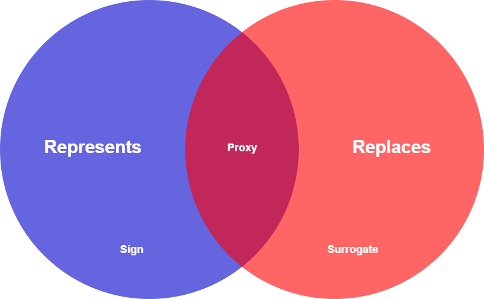
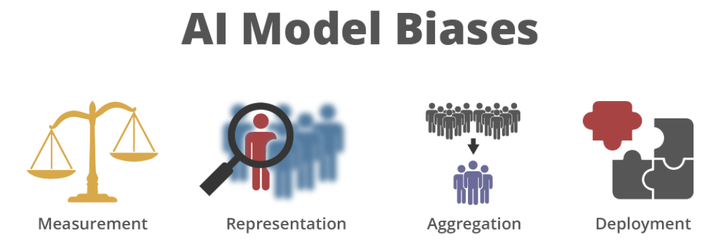

# Ethics in Artificial Intelligence & Intelligent Interfaces

<p align="justify">

## Description

This repository contains comprehensive documents related to the **"Ethics in Artificial Intelligence & Intelligent Interfaces"** courses at the **University of Malta**. The contents delve into critical discussions on interface design, proxies, algorithmic fairness, and ethical dilemmas.

# Ethics in Artificial Intelligence

## Abstract:

*This paper provides a comprehensive introduction to the concepts of proxies and algorithmic fairness, as well as an ethical analysis of both. Additionally, this research outlines a variety of proxies, making reference to formal mathematical representations as well as societal applications, in addition to providing potential reasons for their application. In the case of misused proxies, the potential for discrimination, both causal and opaque, is underlined through the analysis of case studies and formalisation with respect to the machine learning process. An in-depth definition of algorithmic fairness and the challenges it poses are provided. This research highlights different forms of bias in AI models and their causes, in conjunction with methods for mitigating them.
An ethical discussion on algorithmic decision-making is presented, with an emphasis on the degree of impact that these algorithms have on individuals as reflected in the EU AI Act. The paramount responsibility of dataset curators and machine learning engineers in creating unbiased datasets and continuously monitoring AI models is highlighted. The advantages and shortcomings of both AI models and subjective human judgement are compared and contrasted, and an approach incorporating a balance of both moving forward is proposed.*

## Introduction:
The concept of proxies, rooted in the term `"procuracy"`, refers to an entity capable of both representing and replacing another item. Mathematically formalized as an implication, a proxy denoted as $P$ for a represented item $R$ must fulfill the conditions of representation and replacement. Floridi introduces the concept of `"degenerate proxies"`, categorized as `"Signs"` and `"Surrogates"`. Signs, representing but not replacing, include icons, indexes, and symbols. Surrogates, in contrast, replace without representing. Proxies find application in cases where direct measurement of a variable is challenging, costly, or involves missing values. Notably, proxies have bridged statistical gaps, representing variables like intelligence and quality of life (e.g., IQ and GDP per capita). The effectiveness of a proxy hinges on its predictability and lack of bias, with a focus on mitigating potential discrimination.

<p align='center'></p>
</p>

## Understanding Societal Proxies

*Societal proxies* are abstract representations that convey socially salient information regarding the presence and activities of a group of people. Both online and offline, societal proxies include traditional media (television, radio, newspapers), public demonstrations, surveys, and interviews, as well as online platforms like social media trends, online communities, and news websites. These proxies play a crucial role in understanding society, aiding researchers, businesses, and policymakers in studying public preferences, market trends, and public opinion, respectively.

### Educational Proxies

**Educational proxies** take various forms, integrated into teaching processes or represented by external tutors and mentors. Emotional, behavioral, and cognitive engagement serve as proxies for assessing student performance. However, using proxies like skin color or financial stability can introduce bias, affecting opportunities for students who may require extra assistance.

### Financial Proxies

**Financial proxies** include methodologies like the *Social Return on Investment (SROI)* and indicators such as *Gross Domestic Product (GDP)* and *credit scores*. These proxies assess social, environmental, and economic impacts, aiding evidence-based decision-making and resource allocation. Careful consideration is essential to ensure the accuracy of financial proxies.

### Cultural Proxies

**Cultural proxies** represent traits and characteristics related to a specific culture, applied to increase diversity in various settings. However, challenges arise in justifying the scientific utility of using social identities in genomic research, and the potential for misrepresentation poses difficulties in achieving desired outcomes.

### Medical Proxies

**Medical proxies** like *Durable Power of Attorney for Health Care (DPAHC)* and *Body Mass Index (BMI)* aid decision-making and health assessments. While DPAHC assists in end-of-life decisions, BMI serves as a health proxy. However, BMI's accuracy may vary, and the use of proxies in healthcare requires careful consideration.

<p align='center'></p>
</p>

### Family Proxies

**Family proxies** substitute for individuals who may face challenges in self-expression due to health conditions or other barriers. While family proxies play a vital role in healthcare, recognizing their limitations is crucial to ensure accurate representation of individual preferences.

### Environment Proxies

**Environmental proxies** include indicators for biological, chemical, or geological markers, offering insights into past and present environmental conditions. However, challenges such as spatial and temporal variability contribute to uncertainties in environmental reconstructions.

### Labour Proxies

**Labour proxies** in survey data, like gender, ethnicity, and disability proxies, impact the understanding of economic frameworks. Discrepancies between self-reported and proxy-reported data introduce bias, influencing national figures and societal views.

### Media Proxies

**Media proxies** facilitate access to content and serve as indicators for social behavior. Platforms like *Google Trends*, *Instagram*, and *Twitter* act as proxies for evaluating social distancing measures. However, privacy issues and bias may arise from the use of media proxies.

### Technology Proxies

**Technology proxies** represent the influence of technology on various phenomena, from internet usage impacting wages to artificial neural networks predicting oil production rates. However, the dynamic nature of technology introduces uncertainties and ethical considerations in their interpretation.

### Societal Proxies and Social Bias

While societal proxies play a crucial role in understanding the environment, it is essential to recognize their limitations and potential risks, including the perpetuation of social bias. Social bias can impact the accuracy of conclusions drawn from studies using proxies. Critical examination and awareness of biases are crucial for accurate interpretation of results.


## Proxy Discrimination

Proxy discrimination, observed in artificial intelligence (AI) and big data, refers to the harmful use of proxies for certain class members. It manifests as both **intentional** and **unintentional** forms.

**Intentional proxy discrimination** occurs when proxies intentionally replace legally protected variables. In contrast, **unintentional proxy discrimination** arises when class membership correlates with a neutral goal, leading to rational but unintentional discrimination.

A real-life instance involves the **U.S. Equal Employment Opportunity Commission (EEOC)** investigating Target for unintentional proxy discrimination in pre-employment testing, disproportionately affecting African Americans and Latinos.

### Proxy Discrimination in AI

AI, reliant on training data, builds models without pre-existing hypotheses. Legal constraints, aiming to reduce discrimination, lead to omitted characteristics and potential proxy creation. As AI evolves, proxy discrimination poses challenges for anti-discrimination efforts.

The creation of proxies results from reduced feature space. The AI model, with weights and biases, is trained on datasets, potentially substituting omitted features with proxies. This poses a challenge to anti-discrimination laws, especially in areas like health and employment.

### Mitigating Proxy Discrimination

Addressing proxy discrimination in AI involves:

- Prohibiting discrimination based on non-approved factors.
- Mandating data collection and disclosure of membership in protected classes.
- Requiring ethical algorithms explicitly controlling proxy discrimination.
- Mandating firms to demonstrate causal connections between decision criteria and legitimate objectives.

### Types of Proxy Discrimination

- **Causal Proxy Discrimination:** Inadvertent use of proxies correlated with protected characteristics.
- **Opaque Proxy Discrimination:** Use of proxies for protected characteristics not presently quantifiable.
- **Indirect Proxy Discrimination:** Discriminatory actions based on indirect correlations using prohibited variables.

### Challenges and Coexistence

The predictability of proxy discrimination in AI, whether causal, opaque, or indirect, becomes complex in big data. Coexisting forms may include causal relationships, unknown proxy variables, and indirect correlations, making social implications challenging to evaluate.

## Algorithmic Fairness: Concepts and Challenges

### Introduction
An algorithm is a predefined set of steps for computer operations, essential in creating machine learning models. Training algorithms minimize error between predicted and actual outcomes. In this context, algorithmic fairness aims to reduce biases in models, preventing unjust outcomes, particularly concerning protected characteristics like race and gender.

### What is Algorithmic Fairness
Algorithmic fairness involves reducing biases in machine learning models that could lead to discrimination. It requires recognizing biases in algorithms and understanding their origins in training data. Achieving fairness demands technical improvements, ethical considerations, and societal awareness.

<p align='center'></p>
</p>

### Bias Definition and Types
Bias in machine learning can result from imbalances in datasets or flaws in models, leading to skewed outcomes. Types of biases include measurement bias, representation bias, aggregation bias, and deployment bias.

### Measurement of Algorithmic Fairness
Measuring fairness is complex due to subjective interpretations. Common metrics include disparate impact, demographic parity, equalized odds, and equal opportunity, each providing a distinct perspective on fairness.

### Causes of Algorithmic Unfairness
Unfairness can stem from various sources, including selection bias, systematic errors, survey bias, observer bias, and algorithmic bias.

### Mitigating Algorithmic Unfairness
Mitigation strategies involve framing problems correctly, implementing bias detection and evaluation, and emphasizing model explainability and transparency. Comprehensive, ethical, and iterative approaches are essential throughout the machine learning model life cycle.

## Ethical Discussion on Algorithmic Decision-Making

As society increasingly relies on AI algorithm decisions, the ethical responsibility of developers and user awareness becomes paramount. This discussion emphasizes the importance of ethical and transparent AI design and user explainability, allowing scrutiny of potentially critical decisions affecting livelihoods.

### Degrees of Impact/Risk

The ethical evaluation of AI decisions is linked to their impact on individuals. The EU AI Act classifies AI systems based on risk levels, distinguishing low-impact decisions (artistic or trivial) from moderate-to-high-risk decisions (with potential social, health, or financial implications). Ethical scrutiny is vital for decisions impacting rights, health diagnoses, self-driving cars, facial recognition, insurance, and criminal sentencing.

<p align='center'></p>
</p>

### Algorithmic Fairness in a Biased Society

#### Bias Introduced by Developers

Developers' choices in feature selection, algorithm selection, hyperparameter tuning, and data augmentation can introduce bias. Proper selection, diversity in the development team, and open-source collaboration help mitigate bias.

#### Bias Introduced during Dataset Curation

Dataset collection, curation, and detection of bias involve ensuring diverse sampling, objective curation, and continuous monitoring. Addressing bias in the dataset and retraining the model are crucial steps to avoid discrimination.

#### Biased AI Models vs. Human Judgement

- **Consistency:** AI models provide consistent, reproducible mappings, enabling the detection and treatment of bias. Human judgement may vary due to external factors.
  
- **Bias:** AI models can be biased due to dataset or developer errors, addressable through technical intervention. Humans have inherent subjectivity and individual values.

- **Emotional Intelligence:** While AI models lack nuanced emotion recognition, humans excel in understanding complex emotions, crucial in contexts like legal proceedings. A balanced approach integrating AI efficiency and human contextual understanding ensures ethical decision-making.

The collaborative use of AI models and human judgement strikes a balance, leveraging technology's objectivity while benefiting from human capabilities in nuanced and context-specific decision-making.


## Conclusion and Future Directions

### Proxies

Proxies, though convenient, pose a challenge in perpetuating biases and contributing to unfair algorithmic decision-making. Recognizing proxies as potential sources of bias necessitates a proactive algorithmic design approach. To address these challenges, a multifaceted strategy is required, involving robust data collection, algorithmic transparency, and continuous monitoring. Future directions should focus on developing standardized guidelines, ethical frameworks, and tools for practitioners, fostering awareness and responsibility within the AI community to create fair and unbiased AI systems.

### Algorithmic Fairness and the Ethics of Algorithmic Decision-Making

The discussion on algorithmic fairness underscores its crucial role in shaping responsible AI practices. Insights into formal algorithmic characterizations, fairness measurement methods, causes of unfairness, and mitigation strategies are provided. Ethical considerations are driven by the varying impact and risk levels of AI models on individuals. The recent EU AI Act's risk-based categorization highlights the need for responsible AI deployment.

Bias introduced by developers and during dataset curation emphasizes the importance of informed choices, responsible data practices, and continuous monitoring of AI systems. While AI models offer consistency and optimization potential, challenges persist in understanding complex human emotions. Human judgment, enriched by emotional intelligence, remains indispensable in certain contexts, advocating for a balanced approach.

### Future Directions (Proxies and Algorithmic Fairness)

Future efforts should revolve around developing standardized guidelines, ethical frameworks, and tools for addressing proxies effectively. Fostering a culture of awareness and responsibility within the AI community is crucial for the evolution of fair and unbiased AI systems. Achieving algorithmic fairness requires ongoing commitments to transparency, scrutiny, and collaborative efforts between technological advancements and human understanding. The ethical deployment of AI models emerges as a shared societal responsibility, demanding interdisciplinary collaboration and an ongoing commitment to ethical practices in AI integration.

## Citation

To cite this work, please use the following BibTeX entry:

```bibtex
@article{societalproxies2024,
  title = {A Comprehensive Ethical Analysis on Societal Proxies and Algorithmic Fairness},
  author = {Bartolo, Matthias and Agius, Jerome and Muscat, Isaac and Cachia Enriquez, David and Kenely, Matthew},
  journal = {University of Malta},
  year = {2024},
  note = {Msida, Malta},
}
```

---


# Intelligent Interfaces
Additionally, this repository includes coursework tasks focused on understanding intelligent interfaces.

## Contents:
- **Mental Models and Conceptual Frameworks**: Explored the application of mental models within interfaces.
  - **Chosen Application: Facebook**: Highlighted features, strengths, usage patterns, and potential improvements.

- **Evaluating Intelligence**
  - **Visualization Approaches for Recommender System Output**: Discussed approaches in conceptual analysis and practical implementation of visualizations for recommendation systems.
  - **Usability Characteristics**:
    - **Learnability**: Explored the potential adoption of gesture sets and the use of Venn diagrams to enhance faster learnability.
    - **Efficiency**: Investigated quicker interactions with gesture sets and the significant impact of SetFusion on user performance and motivation.
    - **Memorability**: Noted challenges in memorizing gestures and highlighted SetFusion's improved visual components that enhanced usability.
    - **Errors**: Addressed complexities in gesture-based interactions and the need for adjustment tools like sliders in managing inaccuracies.
    - **Satisfaction**: Explored how gestures in HCI met contextual demands, enhancing user satisfaction and control through SetFusion's visual interface.

- **Future Trends in IUIs & the Role of ASR**
  - **Application of IUI in Healthcare**: Discussed personalized interactions, data privacy concerns, and ethical considerations in healthcare IUIs.
  - **The Evolution of ASR Technology and its Impact on IUI Usability**: Analyzed advancements in speech recognition and the necessity for gender-neutral speech models.

- **Multimodal Interfaces**
  - **Facilitating Multiparty Dialog with Gaze, Gesture, and Speech**: Explored computer models that coordinated conversations and their implications across education, healthcare, and corporate environments.

<br>

---
<p align='center'></p>

</p>